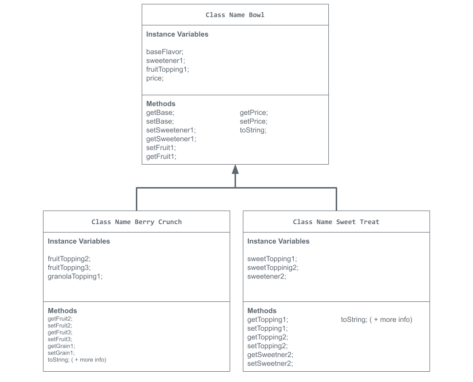

# Unit 2 - Store Management Project

## Introduction

You are opening a new business in your community! Businesses often need programs to manage the products and services they offer and track orders and requests from customers. Your goal is to create a store management system for your business.

## Requirements

Use your knowledge of object-oriented programming and class structure and design to create your store management system:
- **Create a class hierarchy** – Develop a superclass that represents a product or service your business offers and one or more subclasses that extend the superclass to represent more specific types of products or services.
- **Declare instance variables** – Declare instance variables in the superclass that are shared with the subclasses and instance variables in the subclasses that are not shared with the superclass.
- **Write constructors** – Write no-argument and parameterized constructors in the superclass and subclasses. Subclass constructors use the super keyword to call the superclass constructor.
- **Implement accessor and mutator methods** – Write accessor and mutator methods for instance variables that should be accessible and/or modifiable from outside of the class.
- **Implement a toString() method** – Write toString() methods in the superclass and subclasses that return information about the state of an object.

## UML Diagram

Put and image of your UML Diagram here. Upload the image of your UML Diagram to your repository, then use the Markdown syntax to insert your image here.

UML Diagram for my project

## Description

Write a description of your project here. Include what your store you made, and why you chose this topic. In your description, include as many vocab words from our class to explain how you represented the item/service from your store. If you have user input, explain how the user will interact with your store such as which questions are prompted to the user, what response is your program expecting, and how that is used to output information for your store in the console.

 My project is about an Acai bowl store, where customers have the freedom to choose the elements to customize their bowl. I chose this kind of store because I love acai bowls and I'm obsessed with them, especially because it's a healthy option for meals and snacks, depending on how it's built.

Bowl Class: The bowl class for my project uses instance variables for the base flavor, sweetener, fruit topping, and price which is just the general state of an acai bowl. This class utilizes no-argument constructors to make a default acai bowl with a basic base flavor, sweetener, fruit topping, and price. However, the customer is able to change it to custom attributes using parameterizes constructors.

Berry Crunch Class: The Berry Crunch subclass extends the Bowl class, inheriting the instance variables that the bowl class had such as the base flavor, first sweetener, first fruit topping, and price. While it does inherit these, the Berry Crunch class uses additional instance variables such as two more fruit topping and a granola topping, showing the specialized features of this type of bowl. Furthermore, this class uses a constructor signature that lets the customers customize their type of bowl using this 'template', illustrating the topic of overloading.

Sweet Treat Class: The Sweet Treat subclass extends the Bowl class, getting all the Bowl's instance variables. It adds more instance variables and just like it's name, showcases more sweeter options such as a sweet topping and a second sweetener. By using accessor methods, it provides the customer with control over instance variables, encouraging them to customize and create their own acai bowl while also having the basic structure of an acai bowl from the superclass. 

In the end, a concantenation is produced revealing the information of the acai bowl the customer made by joining strings and instance variables from the superclass and subclass. Combining user input and software development elements provides a wide range of possibility and creaitivity for customers to create their personalized acai bowl.